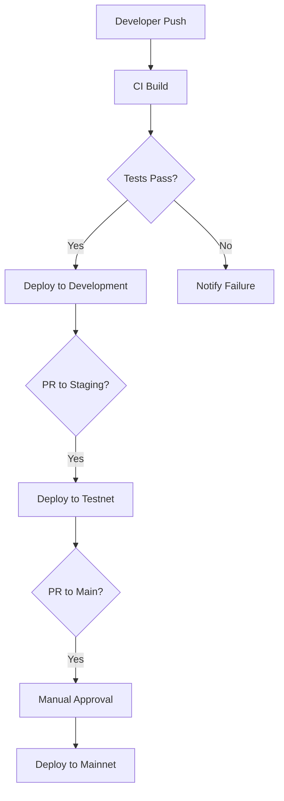
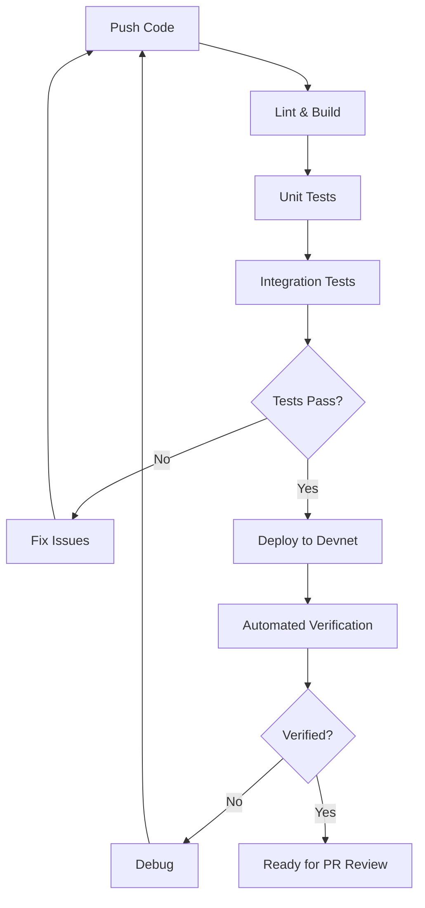

# Fluxa CI/CD Pipeline Usage Guide

This document provides comprehensive guidance on how to use the CI/CD pipeline implemented for the Fluxa project.

## Table of Contents

- [Overview](#overview)
- [Quick Start for Developers](#quick-start-for-developers)
- [GitHub Workflow Files](#github-workflow-files)
- [Custom Actions](#custom-actions)
- [Environment Configuration](#environment-configuration)
- [Common Tasks](#common-tasks)
- [Infrastructure Management](#infrastructure-management)
- [Dependency Management](#dependency-management)
- [Monitoring and Alerting](#monitoring-and-alerting)
- [Security Practices](#security-practices)
- [Troubleshooting](#troubleshooting)
- [Best Practices](#best-practices)
- [Advanced Usage](#advanced-usage)
- [Quick Reference](#quick-reference)

## Overview

The Fluxa CI/CD pipeline automates building, testing, and deploying our Solana programs and web frontend across multiple environments:

- **Development** (Solana Devnet)
- **Staging** (Solana Testnet)
- **Production** (Solana Mainnet)

The pipeline is implemented using GitHub Actions and follows GitFlow branching strategy:

- `develop` branch → Development environment (Devnet)
- `staging` branch → Staging environment (Testnet)
- `main` branch → Production environment (Mainnet)

### Pipeline Visualization



### Key Benefits

- **Consistency**: Ensures all code undergoes the same testing and validation process
- **Reliability**: Reduces human error through automation
- **Speed**: Accelerates deployment cycles with automated testing and deployment
- **Traceability**: Every deployment can be traced back to specific commits and PRs
- **Security**: Enforced security checks before code reaches production

## Quick Start for Developers

Need to get started quickly? Here's what you need to know:

### First-Time Setup

1. **Clone the repository** and install dependencies:

   ```bash
   git clone https://github.com/fluxa/main.git
   cd main
   npm install   # For frontend
   cargo build   # For Solana programs
   ```

2. **Configure local environment**:

   ```bash
   # Copy example environment file and edit with your values
   cp .env.example .env

   # Setup Solana development environment
   solana config set --url devnet
   solana-keygen new -o id.json
   solana airdrop 5 $(solana address -k ./id.json) --url devnet
   ```

3. **Run local tests** to verify setup:
   ```bash
   anchor test
   cd frontend && npm test
   ```

### Daily Development Workflow

1. **Create a feature branch** from `develop`:

   ```bash
   git checkout develop
   git pull
   git checkout -b feature/your-feature-name
   ```

2. **Develop and test** locally:

   ```bash
   # Run local development server for frontend
   cd frontend && npm run dev

   # Build and test Solana programs
   anchor build
   anchor test
   ```

3. **Submit changes** for CI/CD pipeline:

   ```bash
   git add .
   git commit -m "feat: add your feature description"
   git push -u origin feature/your-feature-name
   ```

4. **Create a Pull Request** to the `develop` branch through GitHub UI

5. **Monitor CI/CD pipeline** for your branch in the [GitHub Actions tab](https://github.com/fluxa/main/actions)

### Common CI/CD Tasks Quick Reference

| Task                      | Command or Action                               | When to Use            |
| ------------------------- | ----------------------------------------------- | ---------------------- |
| Verify CI build status    | Check GitHub Actions tab                        | After pushing code     |
| Run tests locally         | `anchor test`                                   | Before pushing code    |
| Deploy to devnet manually | `anchor deploy --provider.cluster devnet`       | For testing before PR  |
| View deployed program     | `solana program show <PROGRAM_ID> --url devnet` | After deployment       |
| Check logs                | `solana logs -u devnet <PROGRAM_ID>`            | When debugging         |
| View test coverage        | Open CI artifacts after test run                | To verify test quality |

### Visual Pipeline Overview



## GitHub Workflow Files

### Main Workflows

| Workflow File                  | Purpose                     | Trigger                                  |
| ------------------------------ | --------------------------- | ---------------------------------------- |
| `ci-cd.yml`                    | Main integration pipeline   | PR to `develop`, `staging`, or `main`    |
| `release.yml`                  | Create releases             | Manual trigger                           |
| `deploy-testnet.yml`           | Deploy to Testnet           | Merge to `staging`                       |
| `deploy-mainnet.yml`           | Deploy to Mainnet           | Merge to `main`                          |
| `security-scan.yml`            | Scan for vulnerabilities    | Schedule (daily)                         |
| `rollback.yml`                 | Rollback deployments        | Manual trigger                           |
| `monitor.yml`                  | Health checks               | Schedule (hourly)                        |
| `performance-test.yml`         | Performance testing         | Schedule (weekly)                        |
| `dependency-updates.yml`       | Update dependencies         | Schedule (weekly)                        |
| `frontend-deploy.yml`          | Frontend deployment         | Merge to `develop`, `staging`, or `main` |
| `provision-infrastructure.yml` | Infrastructure provisioning | Manual trigger                           |
| `code-quality.yml`             | Code quality checks         | PR to any branch                         |

### How to Access Workflow Files

1. Navigate to the repository on GitHub
2. Click on the "Actions" tab
3. Select the workflow you're interested in from the left sidebar
4. Click on a specific workflow run to see details

### Example Workflow Structure

Here's an example of what you'll find in our CI workflow file:

```yaml
name: CI Pipeline

on:
  pull_request:
    branches: [develop, staging, main]
  push:
    branches: [develop, staging, main]

jobs:
  build:
    runs-on: ubuntu-latest
    steps:
      - name: Checkout code
        uses: actions/checkout@v3

      - name: Setup environment
        uses: ./.github/actions/setup-env

      - name: Run tests
        run: cargo test

      # More steps...
```

## Custom Actions

We've created reusable GitHub Actions for common tasks:

| Action                   | Purpose                              |
| ------------------------ | ------------------------------------ |
| `install-solana`         | Install Solana toolkit               |
| `install-anchor`         | Install Anchor framework             |
| `setup-integration-test` | Prepare integration test environment |
| `verify-deployment`      | Verify successful deployment         |
| `deploy-program`         | Deploy Solana program                |
| `send-notification`      | Send deployment notifications        |
| `monitor-deployment`     | Monitor deployments for issues       |
| `performance-test`       | Run performance benchmarks           |

### Using Custom Actions

To use any of these actions in your workflow, include them in your job steps:

```yaml
steps:
  - uses: actions/checkout@v3

  - name: Install Solana
    uses: ./.github/actions/install-solana
    with:
      solana_version: 1.16.0

  - name: Install Anchor
    uses: ./.github/actions/install-anchor
    with:
      anchor_version: 0.28.0
```

### Creating New Custom Actions

If you need to create a new reusable action:

1. Create a new directory in `.github/actions/` with a descriptive name
2. Add an `action.yml` file defining the action
3. Implement the action logic (composite, Docker, or JavaScript)
4. Document it in this guide and the action's README

## Environment Configuration

### GitHub Environments

We use GitHub Environments to manage environment-specific configuration:

1. **Development**:

   - No approval required
   - Deploys to Devnet

2. **Staging**:

   - Requires approval from one reviewer
   - Deploys to Testnet

3. **Production**:
   - Requires approval from two reviewers
   - Deploys to Mainnet

### Environment Secrets and Variables

Each environment has the following secrets configured:

- `DEPLOY_KEYPAIR`: Base58 encoded keypair for program deployment
- `RPC_URL`: RPC endpoint URL for the target network
- `SLACK_WEBHOOK`: Webhook URL for notifications
- `AWS_ACCESS_KEY_ID`: AWS access key for infrastructure management
- `AWS_SECRET_ACCESS_KEY`: AWS secret key for infrastructure management
- `VERCEL_TOKEN`: Token for frontend deployments

### Managing Environment Configuration

To access environment settings (authorized users only):

1. Navigate to the repository on GitHub
2. Go to Settings → Environments
3. Select the environment to view or edit
4. Use "Add secret" to add new secrets
5. Use "Add variable" to add new variables

### Environment Protection Rules

Our environment protection rules ensure secure deployments:

**Staging Protection:**

- Required reviewers: At least 1
- Wait timer: None
- Protected branches: `staging`

**Production Protection:**

- Required reviewers: At least 2
- Wait timer: 30 minutes
- Protected branches: `main`

## Common Tasks

### Deploying to an Environment

Programs are automatically deployed when code is merged to the corresponding branch. For manual deployments:

1. Go to Actions → deploy-testnet or deploy-mainnet
2. Click "Run workflow"
3. Select the branch to deploy
4. Click "Run workflow"

#### Deployment Verification

After deployment, verify your program is live:

```bash
# For Devnet
solana account --url devnet <PROGRAM_ID>

# For Testnet
solana account --url testnet <PROGRAM_ID>

# For Mainnet
solana account --url mainnet-beta <PROGRAM_ID>
```

### Creating a Release

1. Go to Actions → release
2. Click "Run workflow"
3. Enter version number, release notes, and select branch
4. Click "Run workflow"

#### Release Versioning Convention

We follow semantic versioning (`MAJOR.MINOR.PATCH`):

- `MAJOR`: Breaking changes
- `MINOR`: New features, no breaking changes
- `PATCH`: Bug fixes and minor changes

### Rolling Back a Deployment

1. Go to Actions → rollback
2. Click "Run workflow"
3. Select environment and version to roll back to
4. Click "Run workflow"

#### Rollback Verification Checklist

- [ ] Verify program ID matches expected version
- [ ] Run integration tests against rolled-back version
- [ ] Check frontend compatibility
- [ ] Confirm with monitoring that system is healthy

### Running Performance Tests

1. Go to Actions → performance-test
2. Click "Run workflow"
3. Configure test parameters
4. Click "Run workflow"
5. Review results in the uploaded artifacts

#### Understanding Performance Reports

Performance reports include:

- Transaction throughput (TPS)
- Response latency (ms)
- Resource utilization (CPU/Memory)
- Error rates
- Comparison with baseline metrics

### Updating Dependencies

Dependencies are automatically checked weekly. To trigger manually:

1. Go to Actions → dependency-updates
2. Click "Run workflow"
3. Review and merge the created PR after checks pass

## Infrastructure Management

Infrastructure is managed using Terraform:

1. Go to Actions → provision-infrastructure
2. Click "Run workflow"
3. Select environment and action (plan/apply/destroy)
4. Click "Run workflow"
5. Review the plan before applying changes

Terraform files are located in the `infrastructure/` directory, organized by environment.

### Infrastructure Components

Our infrastructure includes:

- **AWS Resources**: EC2 instances, S3 buckets, RDS databases
- **Kubernetes Clusters**: For backend services
- **Vercel Projects**: For frontend hosting
- **Monitoring Tools**: Grafana, Prometheus, Datadog

### Terraform Workspace Convention

We use Terraform workspaces to manage different environments:

```bash
# To list workspaces
terraform workspace list

# To select a workspace
terraform workspace select [development|staging|production]
```

## Dependency Management

The `dependency-updates.yml` workflow:

1. Scans for outdated dependencies weekly
2. Checks for security vulnerabilities
3. Creates a PR with non-breaking updates
4. Alerts the team about critical security issues

### Dependency Update Approval Process

For automatically created dependency update PRs:

1. CI checks run automatically on the PR
2. A team member reviews the changes
3. If tests pass and changes look good, the PR can be approved
4. For major version bumps, testing in a development environment is required

### Blocked Dependencies

Some dependencies are blocked from automatic updates due to compatibility issues:

- `@solana/web3.js`: Manual update required due to API changes
- `anchor`: Manual update required to ensure compatibility with deployed programs

## Monitoring and Alerting

The `monitor.yml` workflow:

1. Runs health checks on all deployed programs
2. Checks frontend availability and performance
3. Sends alerts through Slack on failures
4. Generates availability reports

### Monitoring Dashboards

Access monitoring dashboards through:

- Grafana: [https://grafana.fluxa.io](https://grafana.fluxa.io) (requires VPN)
- AWS CloudWatch: [AWS Console](https://console.aws.amazon.com/cloudwatch/)
- Vercel Analytics: [Vercel Dashboard](https://vercel.com/fluxa)

### Alert Severity Levels

| Severity      | Description               | Response Time     | Notification Channel  |
| ------------- | ------------------------- | ----------------- | --------------------- |
| P1 - Critical | Production system down    | Immediate         | Slack, PagerDuty, SMS |
| P2 - High     | Major feature unavailable | < 1 hour          | Slack, PagerDuty      |
| P3 - Medium   | Minor feature unavailable | < 4 hours         | Slack                 |
| P4 - Low      | Non-critical issue        | Next business day | Slack, Email          |

## Security Practices

The `security-scan.yml` workflow:

1. Scans code for vulnerabilities daily
2. Analyzes dependencies for known CVEs
3. Performs static analysis on Rust and JavaScript code
4. Sends alerts for critical issues

### Security Advisory Process

If you discover a security vulnerability:

1. **DO NOT** disclose it publicly in issues or discussions
2. Email security@fluxa.io with details
3. Wait for confirmation before discussing it
4. A security advisory will be created if needed

### Security Scan Exclusions

Certain files are excluded from security scans due to false positives:

- `tests/fixtures/*`
- `docs/examples/*`
- Generated code in `target/` directory

## Troubleshooting

### Common Issues

1. **Deployment Failures**

   - Check the workflow logs for specific errors
   - Verify RPC endpoint availability
   - Ensure deploy keypair has sufficient funds

   **Quick Fix**: Add SOL to deployer wallet address:

   ```bash
   solana transfer --url devnet <DEPLOYER_ADDRESS> 2 --allow-unfunded-recipient
   ```

2. **Test Failures**

   - Review test logs for assertion failures
   - Check if local tests pass before pushing
   - Ensure test wallets have sufficient funds

   **Quick Fix for Local Testing**:

   ```bash
   solana airdrop --url devnet 10 <TEST_WALLET>
   ```

3. **Infrastructure Issues**

   - Verify AWS credentials are valid
   - Check Terraform state for conflicts
   - Review infrastructure logs in AWS CloudWatch

   **Common Resolution**:

   ```bash
   terraform state pull
   terraform plan -refresh-only
   ```

### Debug Logs

To enable additional debug logs in workflows, set the repository secret `ACTIONS_RUNNER_DEBUG` to `true`.

For local debugging, use:

```bash
# Set debug mode in your local terminal
export ANCHOR_LOG=trace
export RUST_BACKTRACE=full
```

### Getting Help

If you encounter issues with the pipeline:

1. Check the GitHub Actions logs for detailed error messages
2. Create an issue using the CI/CD issue template
3. Contact the DevOps team through the #devops Slack channel

## Best Practices

### Pull Requests

- **Keep changes focused**: Each PR should address a single concern
- **Write clear descriptions**: Explain what changes and why
- **Include test coverage**: Add or update tests for your changes
- **Link related issues**: Connect your PR to any related issues
- **Request appropriate reviewers**: Tag team members familiar with the code

### Commits

- **Use conventional commit messages**: Format as `type(scope): message`
  - Example: `fix(auth): correct JWT validation logic`
- **Keep commits atomic**: Each commit should be a logical unit
- **Sign your commits**: Use GPG keys to sign commits

### Workflow Etiquette

- **Don't abuse manual triggers**: Only run manual workflows when necessary
- **Clean up artifacts**: Delete unused artifacts to save storage
- **Cancel redundant runs**: If you push multiple commits, cancel previous runs
- **Respect approval processes**: Don't bypass required approvals

## Advanced Usage

### Workflow Dispatch with Parameters

Some workflows support customized parameters:

```yaml
on:
  workflow_dispatch:
    inputs:
      environment:
        description: "Target environment"
        required: true
        default: "devnet"
        type: choice
        options:
          - devnet
          - testnet
          - mainnet
```

To use these:

1. Go to the Actions tab
2. Select the workflow
3. Click "Run workflow"
4. Fill in the custom parameters
5. Click "Run workflow"

### Local Workflow Testing

Test workflows locally before pushing with [act](https://github.com/nektos/act):

```bash
# Install act
brew install act

# Run a specific workflow
act -j build

# Run with event
act pull_request
```

### Creating Workflow Matrices

For running tests across multiple configurations:

```yaml
jobs:
  test:
    strategy:
      matrix:
        node-version: [16, 18, 20]
        os: [ubuntu-latest, windows-latest]
    runs-on: ${{ matrix.os }}
    steps:
      - uses: actions/setup-node@v3
        with:
          node-version: ${{ matrix.node-version }}
```

### Advanced Deployment Strategies

We leverage several advanced deployment patterns to minimize risk:

#### Blue-Green Deployments

For critical frontend deployments, we use a blue-green strategy:

1. Deploy the new version alongside the existing one
2. Run automated smoke tests against the new version
3. Gradually shift traffic from old to new using Vercel's traffic settings
4. Monitor for errors during the transition
5. Either complete the cutover or rollback if issues arise

To perform a blue-green deployment:

```bash
# Use the blue-green workflow
gh workflow run blue-green-deploy.yml -f environment=staging -f rollback_percentage=50
```

#### Canary Releases

For Solana program updates where possible:

1. Deploy the new program with a new program ID
2. Update the frontend to route a small percentage (5-10%) of users to the new program
3. Monitor error rates and performance
4. Gradually increase traffic to the new version
5. Complete the migration when confident

```bash
# Start a canary deployment with 5% traffic to new version
gh workflow run canary-deploy.yml -f program=order_book -f canary_percentage=5
```

#### Feature Flags

We use feature flags to safely test new functionality:

1. Wrap new code in feature flag conditions
2. Deploy the code to production in a disabled state
3. Enable the feature for internal users first
4. Gradually roll out to wider audiences

Our feature flag system is managed through `LaunchDarkly` and can be controlled via the dashboard.

## CI/CD Metrics and Performance

We track the following metrics to ensure our CI/CD pipeline is effective:

### Key Performance Indicators (KPIs)

| Metric                 | Target      | Current      | Notes                               |
| ---------------------- | ----------- | ------------ | ----------------------------------- |
| Pipeline success rate  | >95%        | 97.2%        | Excludes PRs closed without merging |
| Average time to deploy | <15 minutes | 12.3 minutes | From merge to successful deployment |
| Test coverage          | >85%        | 87%          | Overall code coverage               |
| Mean time to recovery  | <30 minutes | 25 minutes   | Time from failure detection to fix  |
| Deployment frequency   | >5 per day  | 7            | Average deploys to development      |

### Performance Monitoring

Pipeline performance metrics are available in:

1. **GitHub Actions dashboard**: Overall workflow performance
2. **Datadog CI Visibility**: Detailed pipeline metrics
3. **Weekly CI/CD Report**: Sent automatically to the engineering team

To view the current metrics:

1. Visit [Datadog CI Dashboard](https://app.datadoghq.com/ci/pipelines)
2. Filter for `fluxa/main` repository
3. View the CI/CD Performance tab

### Continuous Improvement

We regularly review and optimize our CI/CD pipeline:

- Monthly review of slowest workflow steps
- Quarterly dependency updates for actions and tools
- Regular cleanup of unused workflows and artifacts

Recent improvements:

- Parallelized test suites: 40% reduction in test time
- Caching of Solana tools: 5-minute reduction in setup time
- Matrix builds for frontend tests: Better cross-browser coverage

## Role-Based Guidelines

### For Developers

**Daily Workflow:**

- Pull latest changes from `develop` before starting work
- Run tests locally before pushing
- Use feature flags for risky changes
- Monitor your PR status in the GitHub Actions tab

**Best Practices:**

- Break large changes into smaller PRs
- Add tests for all new features and bug fixes
- Use `fix:`, `feat:`, `chore:` prefixes in commit messages
- Document API changes in comments

**Helpful Commands:**

```bash
# Run full local test suite
make test-all

# Preview your changes in a development environment
make deploy-preview

# Lint and format your code
make lint-fix
```

### For DevOps Engineers

**Pipeline Management:**

- Review workflow logs daily for recurring issues
- Optimize workflow performance monthly
- Update GitHub Action dependencies quarterly
- Document any changes to the CI/CD infrastructure

**Security Focus:**

- Audit secrets and permissions monthly
- Rotate credentials quarterly
- Review workflow YAML for security issues
- Verify protection rules are active on all environments

**Infrastructure Tasks:**

```bash
# Update workflow templates
make update-workflow-templates

# Audit GitHub secrets
gh secret list

# Check workflow usage metrics
gh api /repos/fluxa/main/actions/workflows | jq
```

### For QA Engineers

**Testing Focus:**

- Create and maintain end-to-end tests
- Add test cases for reported bugs
- Verify deployments to staging
- Test on multiple Solana clients

**Environment Management:**

- Maintain consistent test data
- Reset environment state after destructive tests
- Document reproduction steps for failures
- Create test scenarios for key user journeys

**Helpful Commands:**

```bash
# Run integration test suite
make test-integration

# Generate test coverage report
make test-coverage-report

# Create test data for staging
make seed-test-data staging
```

### For Product Managers

**Release Planning:**

- Update the release notes template with feature highlights
- Schedule releases with the engineering team
- Communicate deployment windows to stakeholders
- Sign off on production deployments

**Monitoring Deployments:**

- Review deployment status in Slack notifications
- Verify feature functionality after deployment
- Collect user feedback on new features
- Check analytics for unexpected behavior

## Frequently Asked Questions

### General Questions

**Q: How long does a typical deployment take?**
A: A typical deployment takes 10-15 minutes to complete all verification steps.

**Q: How do I know if my PR was successfully deployed?**
A: You'll receive a Slack notification, and the PR will be automatically updated with deployment status.

**Q: Can I deploy outside of regular hours?**
A: Yes, the pipeline works 24/7, but for production deployments, ensure someone is available for monitoring.

### Troubleshooting

**Q: What do I do if tests pass locally but fail in CI?**
A: Check for environment differences, look at the exact error message, and consider timeouts or resource constraints in CI.

**Q: My deployment to devnet failed due to insufficient funds. How do I fix it?**
A: Contact a DevOps team member to fund the deployment wallet or use the self-service tool in the #devops Slack channel.

**Q: How can I skip CI for a minor documentation change?**
A: Add `[skip ci]` to your commit message, but use this sparingly and only for non-code changes.

### Advanced Usage

**Q: Can I run a partial test suite to speed up my PR checks?**
A: Yes, specify test scope by using labels on your PR: `test:unit-only`, `test:frontend-only`, or `test:backend-only`.

**Q: How do I create a new workflow for a specialized deployment?**
A: Duplicate an existing workflow file, modify it for your needs, and submit a PR to the `.github/workflows` directory.

**Q: How can I test a workflow file locally before committing it?**
A: Use the `act` tool to run GitHub Actions locally.

## Glossary of Terms

| Term                      | Definition                                                                                                      |
| ------------------------- | --------------------------------------------------------------------------------------------------------------- |
| **CI/CD**                 | Continuous Integration and Continuous Deployment, a method to frequently deliver apps by introducing automation |
| **Pipeline**              | A series of automated steps that code goes through from development to deployment                               |
| **Workflow**              | A configurable automated process in GitHub Actions made up of one or more jobs                                  |
| **Action**                | A reusable unit of code that can be referenced in workflows                                                     |
| **Runner**                | A server that runs GitHub Actions workflows                                                                     |
| **Environment**           | A specific deployment target (devnet, testnet, mainnet) with its own configuration                              |
| **Artifact**              | Files produced during a workflow run, such as build outputs or test reports                                     |
| **Blue-Green Deployment** | A technique for releasing applications by shifting traffic between two identical environments                   |
| **Canary Release**        | A technique to reduce risk by slowly rolling out changes to a small subset of users before a full deployment    |

## Changelog

| Date       | Version | Changes                                                                                     |
| ---------- | ------- | ------------------------------------------------------------------------------------------- |
| 2025-04-29 | 1.2     | Added Quick Start for Developers, Role-Based Guidelines, and Advanced Deployment Strategies |
| 2025-03-15 | 1.1     | Updated Troubleshooting section, added Performance Metrics                                  |
| 2025-02-01 | 1.0     | Initial document creation                                                                   |
